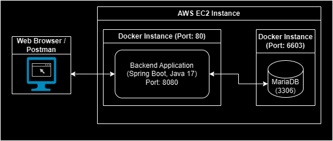

# Kargo Software Engineer 2 - Test

**Author**: Siddharth Satish Shenoy (siddh.shenoy@gmail.com)

# About

This ReadMe file encapsulates the documentation for the Reading List Application API that was designed as a part of the coding test. This document covers the following topics in detail:

1. Architecture Overview
2. API Specification (i.e., the design, url endpoints, etc)
3. Database configuration
4. Tutorial of accessing the API

# Architecture Overview

In this section, I will be describing the how the basic components of the API are laid out. Below is the basic diagram which should give an overview of the flow of the API beginning from the backend to the MySQL service



# API Specification

The API follows a CRUD (Create, Read, Update, Delete) REST-API format specification. This API different HTTP methods for different functionality which are defined as follows:

|Sr. No. | Operation     | HTTP Method | 
|---------------|---------------|-----------|
| 1 | Create        | POST      |
| 2 | Read       | GET  |
| 3 | Update       | PUT |
| 4 | Delete | DELETE |

## 1. Creating an entry in the reading list

### URL Endpoint: 

http://localhost:8080/reading_list/v1/

### Method:

**POST**

### Content:

```
{
    "isbn": <UNIQUE_ISBN_NUMBER>,
    "title": <BOOK_TITLE>
    "author": <AUTHOR_NAME>
    "bookStatus": <BOOK_STATUS>
}
```

Parameter Specification:

1. *isbn* : String, 10 or 13 digits (can use isbn format)
2. *title* : String
3. *author* : String
4. *bookStatus* : Enumeration { Unread, InProgress, Finished }

### Response

SUCCESS

```
{
    "status": "SUCCESS",
    "message": "Book inserted successfully!"
}
```

ERROR

```
{
    "status": "ERROR",
    "error": {
        "code": 100,
        "message": "Duplicate key error",
        "details": "An attempt was made to insert a book whose ISBN is already present in the database, this should be unique!"
    }
}
```

OR

```
{
    "status": "ERROR",
    "error": {
        "code": 10,
        "message": "Validation Failure",
        "extra": {
            "ISBNValidation": "Invalid ISBN, should only contain digits!",
            "AuthorValidation": "Author name should not be empty!",
            "TitleValidation": "Title should not be empty!",
            "StatusValidation": "Book status should not be empty!"
        }
    }
}
```


## 2. Reading all/one entry from the reading list

### URL Endpoint: 

For All Entries: http://localhost:8080/reading_list/v1/

For One Entry: http://localhost:8080/reading_list/v1/{isbn_number}

### Method:

**GET**

Parameter Specification:

1. *isbn_number* : String, 10 or 13 digits (can use isbn format)

### Response

The response for all/one entry remains the same. For multiple entries a list / array object is returned.


MULTIPLE ENTRY:

```
[
    {
        "title": "Thinking with Maps",
        "bookStatus": "Unread",
        "author": "Bertram C. Bruce",
        "isbn": "978-1-4758-5929-4"
    },
    {
        "title": "Thinking in Systems",
        "bookStatus": "Unread",
        "author": "Donella Meadows",
        "isbn": "978-1-6035-8055-7"
    },
    {
        "title": "Clojure in Action",
        "bookStatus": "Unread",
        "author": "Amit Rathore",
        "isbn": "978-1-6383-5533-5"
    }
]
```

SINGLE ENTRY:

```
{
    "title": "Clojure in Action",
    "bookStatus": "Unread",
    "author": "Amit Rathore",
    "isbn": "978-1-6383-5533-5"
}
```

## 3. Updating an entry in the reading list

### URL Endpoint: 

http://localhost:8080/reading_list/v1/

### Method:

**PUT**

### Content:

```
{
    "isbn": <UNIQUE_ISBN_NUMBER>,
    "title": <BOOK_TITLE>
    "author": <AUTHOR_NAME>
    "bookStatus": <BOOK_STATUS>
}
```
Parameter Specification:

1. *isbn* : String, 10 or 13 digits (can use isbn format, should be an existing book)
2. *title* : String
3. *author* : String
4. *bookStatus* : Enumeration { Unread, InProgress, Finished }

### Response

SUCCESS

```
{
    "status": "SUCCESS",
    "message": "Book updated successfully!"
}
```

ERROR

The response pattern for this method follows the same pattern as that of the POST method.

## 4. Deleting an entry in the reading list

### URL Endpoint: 

http://localhost:8080/reading_list/v1/{isbn_number}

### Method:

**DELETE**


Parameter Specification:

1. *isbn_number* : String, 10 or 13 digits (can use isbn format, should be an existing book)

### Response

SUCCESS

```
{
    "status": "SUCCESS",
    "message": "Book deleted successfully!"
}
```
# Database configuration

The database configuration is pretty straightforward and simple. The database schema is named as `reading_list_app` and the table for maintaining the book record is named as `BOOKS` (case-sensitive for *nix systems).

The database is configured with default port (3306) and uses the root user for this assignment (for now). A much more specific user that is dedicated for performing CRUD operations can be created and utilized.

Following the the description of the `BOOKS` table:


| Field      | Type                                   | Null | Key | Default | Extra |
|------------|----------------------------------------|------|-----|---------|-------|
| ISBN       | varchar(32)                            | NO   | PRI | NULL    |       |
| Title      | varchar(64)                            | YES  |     | NULL    |       |
| Author     | varchar(64)                            | YES  |     | NULL    |       |
| bookstatus | enum('Unread','InProgress','Finished') | YES  |     | Unread  |       |

# Accessing the API

The API is hosted on AWS using EC2. The EC2 instance hosts the application in a docker environment separate from that of the database environment. The spring boot application internally listens to the port 8080 however, the docker application maps the external port 80 as the listening endpoint for the application.

The URL for the AWS EC2 instance is as follows:

http://ec2-13-53-135-98.eu-north-1.compute.amazonaws.com/reading_list/v1/